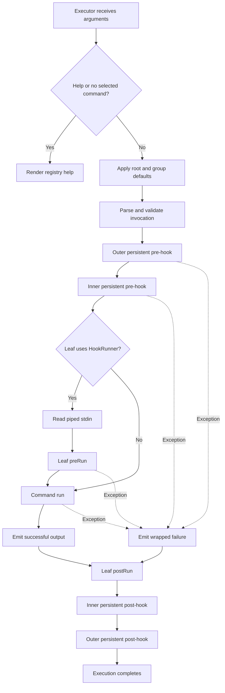

# Mamba CLI Framework Analysis

This report is based exclusively on the implementation in `lib/` and the
behavior specified in `test/`. It does not draw conclusions from the README,
package metadata, executables, or other project folders.

## Executive summary

Mamba is a declarative Dart CLI framework built around a staged pipeline:

```text
Command definitions
        ↓
Validated command registry
        ↓
Token parser
        ↓
Executor and hooks
        ↓
Command result, help, or failure
```

Its strongest architectural choices are:

- Command definitions are separated from parsing and execution.
- Registries provide a canonical, serializable command model.
- Parsing produces typed maps instead of requiring commands to reinterpret raw
  tokens.
- Root and group-level inputs can be inherited without copying them into every
  child registry.
- Production execution and test execution use the same orchestration path.
- Help and completion artifacts derive from registry metadata.

The principal weaknesses are error consistency, several misleading or
misspelled messages, defaults that are declared but not always applied, and
lifecycle edge cases around hook failures.

## Architecture

The public API is re-exported through [`lib/mamba.dart`](lib/mamba.dart).
Internally, the framework has seven conceptual layers.

### Definition model

[`lib/command.dart`](lib/command.dart) contains the declarative domain model:

- Commands and command groups
- Positionals and variadics
- Boolean and counting flags
- Typed, repeatable, paired, and accessor options
- Parsed-result record types
- Completion commands
- Standard-input processing
- Ordinary and persistent hooks
- The serialized `RegistryMap` schema

This file is the framework's core vocabulary.

### Registry and validation

[`lib/registry.dart`](lib/registry.dart) converts command objects into
`CommandRegistry` nodes. Each registry indexes its local inputs by name and
points to its parent and child registries.

The registry is responsible for:

- Validating names, aliases, descriptions, defaults, and collisions
- Reserving `--help` and `-h`
- Separating local inputs from inherited inputs
- Resolving command aliases
- Finding the registry selected by an invocation
- Exporting the tree through `toMap()`

Root flags and options are published to all descendants. A `GroupCommand` can
additionally publish `inheritedFlags` and `inheritedOptions`. Positionals,
variadics, accessors, paired groups, and ordinary group-local inputs are not
inherited.

Local inputs override inherited inputs with the same name. That gives
descendants a deliberate shadowing mechanism.

### Parsing

[`lib/parser.dart`](lib/parser.dart) performs command discovery and input
parsing without executing anything.

Its output is a record containing:

- The canonical command path
- Parsed single, repeated, and variadic positionals
- Typed named-input maps
- The unmodified arguments following `--`

The parser discovers aliases but returns canonical command names. It
understands inherited inputs while walking nested command paths, so global
options can appear around command tokens.

### Execution

[`lib/executor.dart`](lib/executor.dart) is the composition root. It builds the
registry, assigns the complete registry map to completion commands, applies
default command paths, invokes the parser, runs hooks, executes the selected
command, and reports the result.

Two adapters are supplied:

- `create()` writes normal output to stdout, failures to stderr, and sets exit
  code `1`.
- `fake()` returns `MambaSuccessResult` or `MambaFailureResult` without touching
  process streams.

The executor automatically adds:

- `--dry-run`, a boolean flag
- `--verbose` / `-v`, a counting flag

The registry separately provides `--help` / `-h`.

The root itself has no `run()` implementation. If no command is selected and
no default applies, the executor renders help.

### Help formatting

[`lib/help_formatter.dart`](lib/help_formatter.dart) defines a customization
boundary and an ANSI-styled default formatter.

The default output can include:

- Command usage and short description
- Long description
- Flags
- Accessor flags
- Options
- Child commands

Required expressions use angle brackets, optional expressions use square
brackets, repeated values use `+` or bounded repetition syntax, and hidden
inputs remain parseable but are omitted.

### Context

[`lib/context.dart`](lib/context.dart) provides identity-based typed keys:

- `MambaContext` allows mutation.
- `MambaReadContext` exposes only reads.
- Two different key instances with the same type remain independent.

The executor owns one context for its lifetime, so context values can persist
across multiple `execute()` calls on the same executor, not merely across hooks
within one call.

### Error boundary

[`lib/errors.dart`](lib/errors.dart) defines:

- `MambaRegistryError extends Error` for definition invariants
- `MambaException implements Exception` for recoverable failures
- `MambaParseException` for invocation failures
- `MambaCommandNotFoundException` for failed registry traversal

During `execute()`, ordinary `Exception` values are converted into
`MambaException` failures. `Error` values are not caught. Errors thrown while
constructing the executor also occur outside the execution boundary.

`MambaException.toString()` renders as:

```text
MambaParseException message
```

There is no colon between the runtime type and message.

## Commands

### Command types

`Command` is the leaf abstraction. A subclass declares metadata and implements:

```dart
FutureOr<String?> run(
  ParsedPositionals positionals,
  ParsedNamedInputs inputs,
  List<String> trailingArguments,
)
```

Returning `null` suppresses output.

`GroupCommand` adds:

- Child commands
- Inherited flags and options
- An optional relative default subcommand path
- `runChildCommand()` for direct child-path execution

`CompletionCommand` receives the entire validated root `RegistryMap`, even when
deeply nested.

### Naming and aliases

Command names:

- Cannot be empty
- Cannot contain spaces
- Cannot contain numbers
- Cannot be exactly `_` or `-`
- Cannot contain symbols other than `_` and `-`

This is stricter than named inputs, which may contain numbers after the first
letter.

Aliases are sibling-scoped and canonicalized during parsing. An alias list is
invalid when it is explicitly empty, contains an unusable token, duplicates
itself, equals the command name, collides with a sibling command name, or is
already assigned to another sibling.

### Defaults

The executor can provide a root-relative default command path. Each group can
provide its own relative default path. Defaults are inserted after registered
value-taking inputs, allowing an invocation such as:

```text
tool --config settings.json
```

to select a default command without treating `settings.json` as a command.

Default paths must:

- Be non-empty
- Contain no empty segments
- Be relative and therefore omit the executor or group name

An unknown default path becomes an execution failure.

### Command errors

Definition-time command errors include:

- `MambaException` for empty names, spaces, numbers, invalid descriptions,
  alias violations, duplicate commands, and positional/command collisions
- `MambaRegistryError` for unsupported command-name symbols

Runtime command errors include:

- `ArgumentError` for an empty or parent-qualified `runChildCommand()` path
- `MambaException("command not found in …")` when a relative child cannot be
  found
- `MambaCommandNotFoundException` during direct registry traversal, including
  the parent and available commands
- Any exception thrown by `run()`, normally wrapped or preserved by the
  executor as a `MambaException`
- Any `Error` thrown by a command escapes the executor

The command validation messages need editorial work. Examples include “There
should no spaces…” and “150 lines of code” when the code is actually validating
a 150-character description limit.

## Flags

### Boolean flags

`BooleanFlag` supports:

- `--long-name`
- An optional single-letter short alias
- Short flag bundles
- A boolean default, normally `false`
- Optional `--no-name` negation
- Hidden help presentation

An explicitly supplied positive or negative form overrides the default.
Defaults are added to the returned boolean map even when the flag is omitted.

### Count flags

`CountFlag` increments for every occurrence:

```text
-vv
--verbose --verbose
```

Both forms produce a count of `2`. Count flags do not receive implicit zero
entries; an unused count flag is absent from its map.

### Scope and inheritance

Root flags are global. Group `inheritedFlags` apply to descendants. Ordinary
flags declared by a group or leaf are local.

The help flag is recognized before `--`. Anything following `--` is never
treated as help or another flag.

### Flag errors

Definition-time failures include:

- `MambaRegistryError` when a name does not begin with a letter or contains
  characters other than letters, numbers, and hyphens
- `MambaRegistryError` when a short alias is not one letter
- `MambaRegistryError` when `help` or `-h` is redeclared
- `MambaException` for duplicate names, flag/option name collisions, or
  duplicate short aliases

Parse-time failures include:

- `Flag --name does not accept a value` for `--flag=value`
- `This isn't a registered flag` for unknown long flags or invalid negation
- `This isn't a registered short flag or option` for an unknown bundle member
- Excess non-flag tokens ultimately becoming positional-layout errors

There is a spelling-quality issue elsewhere in the same parser family: unknown
dotted paths report “registered acessor.”

## Options

### Ordinary options

Mamba supports:

- `StringOption`, validated by a complete regular-expression match
- `IntOption`, accepting signed decimal integers
- `DoubleOption`, accepting signed integers or decimals with digits on both
  sides of the decimal point
- `ChoiceOption`, accepting an enum member's `.name`
- Repeatable string, integer, and double variants

Accepted syntax includes:

```text
--name value
--name=value
-n value
```

Only one-letter short aliases are valid. Unlike flags, options are not bundled.

Repeatable options accumulate values into lists. Repeating a non-repeatable
option replaces its previous map value.

Negative numeric values are accepted as separate tokens. Values such as `.5`
and scientific notation such as `1e2` are rejected for doubles.

### Paired options

`PairedOptions` groups `PairOption` members.

A normal pair behaves as an all-or-none unit:

- If none are supplied and the group is optional, parsing succeeds.
- If some but not all are supplied, parsing fails.
- If the group is required, every member must be present.

A variant pair represents alternatives:

- At most one member can be supplied.
- A required variant requires exactly one.

Pair members may be string, integer, double, choice, or repeatable typed
values.

### Accessor options

Accessor lists model nested dotted paths:

```text
--server.tls.certificate cert.pem
```

Values are returned as nested maps. Hidden accessor lists hide all descendants
from help while leaving them parseable.

Choice defaults are recursively merged into explicitly supplied accessor
structures.

### Option defaults

The parser applies defaults for:

- Ordinary `ChoiceOption`
- `AccessorChoiceOption`

Although `PairChoiceOption`, `ChoicePositional`, and `ChoiceVariadic` expose and
serialize `defaultValue`, the parser does not apply those defaults. This is an
important semantic inconsistency.

### Option errors

Missing values throw:

```text
Option --name requires a value
```

Type and validation errors include:

- String regex: `This value doesn't satify the requirement`
- Invalid choice: `<value> is not a valid choice for <name>` followed by the
  available names
- Integer: `Invalid int value: … never have spaces in between numbers`
- Double: `Invalid double value: … never have spaces in between numbers`
- Unknown accessor: `This isn't a registered accessor`

Required-option wording is inconsistent:

- Required strings: `The name is required`
- Other required types: `Option --name is required`

Paired-option errors are clearer:

- `Required paired options are missing: --name`
- `Paired options … must be passed together`
- `One variant option is required: …`
- `Variant options … accept only one option`

Accessor integer and double classes expose unsigned, narrower `regex` getters,
but parsing bypasses those getters and uses the parser's signed numeric rules.
The declared accessor regex and actual parser behavior therefore do not fully
agree.

## Arguments

### Mandatory and discretionary positionals

Positionals are registered in two ordered lists:

- Mandatory positionals must receive values.
- Discretionary positionals may be omitted.

Every positional is either regex-based or enum-choice-based. Validation matches
the entire token.

Mandatory positionals are consumed before discretionary positionals. Within
each list, registration order controls assignment.

### Repeated positionals

A repeated positional greedily consumes several values. Its `times` property
counts additional repetitions, so the default `times: 1` accepts up to two
values.

The parser does not backtrack. A repeated positional may greedily consume values
that a later positional would otherwise have accepted.

Negative `times` values throw `ArgumentError` during definition.

### Trailing arguments and variadics

`--` ends normal parsing. Every later token:

- Is preserved in `trailingArguments`
- Is not interpreted as a command, flag, option, or ordinary positional
- Is optionally validated and named by a registered `Variadic`

A `NormalVariadic` applies a regex to every trailing token. A `ChoiceVariadic`
accepts enum member names. Failures identify the precise zero-based trailing
index and variadic name.

`RepeatedChoiceVariadic` parses like `ChoiceVariadic`; its distinction is used
by completion generation to offer choices for every trailing slot.

Trailing arguments are allowed even when no variadic is registered; they are
simply not added to the variadic map.

### Argument errors

Mandatory positional failures use:

```text
The <name> is required at <index> after this command
```

Other failures include:

- Excess values: `This term isn't a registered command positional`
- Invalid variadic entry: `The term at index N isn't accepted by the <name>
  variadic`
- Invalid discretionary positional: a raw `ArgumentError`, unlike the
  surrounding `MambaParseException` behavior

That raw `ArgumentError` is caught and generically wrapped during executor
execution, but direct parser consumers observe a different exception category.

## Hooks

Mamba has two hook models.

`HookRunner` applies to the final selected command:

- `preRun()` receives piped standard input, a read-only context, positionals,
  and non-repeated ordinary options.
- `postRun()` receives the read-only context.

`PersistentHookRunner` applies to selected group commands along the command
path:

- Pre-hooks run outermost group to innermost group.
- Post-hooks run innermost group to outermost group.
- Both receive mutable context, positionals, and non-repeated ordinary options.

The option record supplied to hooks excludes boolean flags, count flags,
repeatable options, paired repeatable values, and accessors. The command's
`run()` method still receives the complete parsed input record.



Important lifecycle details:

- Pre-hooks are synchronous; post-hooks may be asynchronous and are awaited.
- Standard input is read only for a final command using `HookRunner`.
- Output or failure is emitted before post-hooks run.
- Post-hooks run from `finally`, so they run after a pre-hook or command
  exception.
- Because the persistent runner list is established before pre-hooks begin, all
  persistent post-hooks are attempted even if an earlier persistent pre-hook
  failed.
- An ordinary post-hook runs even if its own `preRun()` failed.
- A post-hook exception occurs outside the executor's catch block and therefore
  escapes instead of becoming `MambaFailureResult`.
- If an inner persistent post-hook throws, iteration stops and outer cleanup
  hooks may not run.
- The tests cover normal hook order and group defaults, but do not cover nested
  hook ordering or these failure paths.

These cleanup semantics deserve explicit tests and probably a more defensive
implementation.

## Guideline compliance observations

Several points conflict with the project's documented code guidelines:

- Framework failures primarily use thrown exceptions and `Error`, rather than
  explicit error return values.
- `MambaRegistryError` has no custom `toString()`, making it less useful as a
  user-facing failure.
- Error categories are inconsistent: comparable invalid invocations can produce
  `MambaParseException`, `ArgumentError`, `FormatException`, `StateError`, or an
  uncaught `Error`.
- User-visible messages contain spelling and wording defects: “acessor,”
  “satify,” “postionals,” “mesaage,” and the inaccurate “150 lines of code.”
- The hook tests do not cover failure cleanup, nested persistent order, or
  post-hook failures.
- Declared choice defaults are not applied uniformly.
- There is a duplicated documentation comment above `PairStringOption`.

On the positive side, state mutation is generally kept close to its owning
parser or context, the command model is strongly typed, files are organized by
cohesive concepts, and tests focus predominantly on behavior.

## Integrations

[`lib/integrations.dart`](lib/integrations.dart) contains a deliberately narrow
integration layer.

### Registry map boundary

`RegistryMap` is a deeply validated, immutable serialized command description.
It requires `name` and `description` at every command level and validates
optional flags, options, positionals, variadics, accessors, aliases, and
descendants.

Malformed maps throw `ArgumentError.value()` with a dotted path such as:

```text
commands.publish.options.format.valueType
```

This is a good integration boundary because converters do not need live command
objects.

### Carapace conversion

`CarapaceSpecConverter` converts a `RegistryMap` into YAML containing:

- Command names, descriptions, aliases, and descendants
- Local and persistent flags
- Required, optional, repeatable, and hidden modifiers
- Exclusive flag groups
- Boolean defaults
- Positional and option completions
- Dash and repeated-dash completions

Completion behavior includes:

- File completion for general string values
- Enum values for choice positionals
- One bounded completion slot per repeated positional occurrence
- Integer ranges from `0` to `1000`
- Two-decimal numeric ranges for doubles
- `dash` completion for a single variadic choice set
- `dashany` completion for repeated choice variadics

Inherited root and group inputs become Carapace `persistentflags`. Local
definitions replace inherited entries with the same name.

Paired options are exported through first-class `optionGroups` metadata, which
retains group membership, requiredness, and all-or-one-of behavior. Accessors
use a uniform recursive schema carrying leaf types, choices, defaults, and
hidden state. The converter flattens accessor leaves into dotted Carapace flags
and retains support for legacy description-only accessor maps.

### Carapace writing

`CarapaceSpecWriter` writes synchronously and creates missing parent
directories.

Default destinations are:

- Development: system temp directory
- Windows production: `%APPDATA%`
- macOS production: `$HOME/Library/Application Support`
- Other platforms: `$XDG_CONFIG_HOME` or `$HOME/.config`

All destinations end in:

```text
carapace/specs/<command>.yaml
```

If a production configuration directory cannot be located, the writer throws
`StateError`. Directory creation or writing can also propagate
`FileSystemException`. These integration failures are not translated into
Mamba's error hierarchy.
