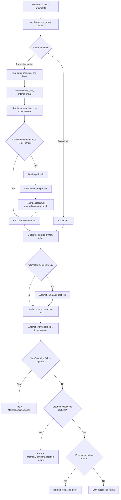

# Mamba CLI Framework Architecture Report

This report is based exclusively on the implementation in `lib/` and the
behavior specified in `test/`. The README, package metadata, executables, and
other project folders were not used to infer framework behavior.

The current verification baseline is maintained with the implementation and
behavioral test suite. See `MIGRATION.md` for the 0.3.0 breaking changes.

## Executive summary

Mamba is a declarative Dart CLI framework with a clear definition-to-execution
pipeline:

```text
Command objects
    -> CommandRegistry validation and indexing
    -> optional RegistryMap serialization
    -> Parser token classification and typed values
    -> Executor command selection and hook lifecycle
    -> output, help, or a typed failure result
```

Its central architectural boundary is `CommandRegistry`. Command objects are
the authoring model, while a registry is the validated and indexed runtime
model. The parser consumes a selected registry and produces a sealed outcome:
a typed invocation or a parser-owned help request. The executor then supplies
invocation values to hooks and to the selected command.
Help and Carapace completion output are also derived from registry metadata.

The current version has notably stronger lifecycle and integration behavior
than the previous report described. Pre-hooks are asynchronous, cleanup is
attempted for every successfully entered hook, cleanup exceptions are
aggregated, output is delayed until cleanup completes, and registry export now
retains paired-option groups, accessor types, choices, defaults, and regex
patterns.

## Architecture

### Public API and module boundaries

[`lib/mamba.dart`](lib/mamba.dart) is the package barrel. It exports the
definition model, context, errors, executor, help formatter, integrations,
parser, and registry.

The implementation is organized by responsibility:

| File | Architectural role |
| --- | --- |
| `lib/command.dart` | Command and input definitions, parsed record types, `RegistryMap`, completion commands, stdin wrappers, and hook contracts |
| `lib/registry.dart` | Definition validation, name indexing, inheritance, command discovery helpers, and registry serialization |
| `lib/parser.dart` | Token classification, typed conversion, defaults, requiredness, pairs, positionals, accessors, and variadics |
| `lib/executor.dart` | Composition root, defaults, help routing, command lookup, hooks, output, and failure normalization |
| `lib/help_formatter.dart` | Styled help grammar and the default ANSI formatter |
| `lib/context.dart` | Typed executor-scoped mutable context and its read-only view |
| `lib/errors.dart` | Registry, execution, integration, and general framework failures |
| `lib/integrations.dart` | `RegistryMap` converters and Carapace spec writing |

### Definition model

[`lib/command.dart`](lib/command.dart) is the framework vocabulary. Its sealed
input hierarchies make invalid runtime type combinations difficult to express:

- `Flag` divides into `BooleanFlag` and `CountFlag`.
- `Option` divides into single and repeatable typed options.
- `PairOption` models values owned by a `PairedOptions` group.
- `AccessorOption` divides into nested lists and primitive leaves.
- `Positional` includes normal, choice, and bounded repeated forms.
- `Variadic` owns values following `--`.

Regex-backed definitions expose `RegExpValidated`; enum-backed definitions
expose `ChoiceValidated<T>`. Parsing stores enum choices by their `.name`, not
as enum instances.

Definitions are mostly passive values. Validation is intentionally deferred to
registry construction, except for a few local invariants such as a negative
repeated-positional count or an invalid default-command path.

### Registry construction and validation

[`lib/registry.dart`](lib/registry.dart) converts the root surface and every
child `Command` into `CommandRegistry` nodes. A node stores local declarations
in name-indexed maps and links to its parent and children.

Registry construction validates:

- Command, alias, input, positional, variadic, and accessor names
- Short aliases
- Empty and overlong descriptions
- Reserved `help` and `-h` declarations
- Duplicate commands, aliases, input names, and short aliases
- Flag/option/accessor collisions
- Positional collisions and positional/command collisions
- Empty paired groups and duplicate pair members
- Multiple defaults in one variant pair group
- Empty choice sets and defaults that are not registered enum choices
- Required choice inputs that declare defaults
- Descendant attempts to override published global flags
- Nested accessor definitions recursively

The shared long-name grammar is letter-led words separated by hyphens or
underscores. Digits are currently rejected everywhere by the actual regular
expression, despite some validation messages saying otherwise.

The registry keeps locally declared inputs separate from published inputs:

- Root flags and options are published globally.
- A `GroupCommand` may publish `inheritedFlags` and `inheritedOptions` to its
  descendants.
- Positionals, variadics, accessors, paired groups, and ordinary group-local
  inputs are not inherited.
- `withInheritedInputs()` materializes inherited flags and options into a copy
  used by parsing and help formatting.

Local options override same-named inherited options. Published flags are
immutable at descendant levels: a group or leaf may not redeclare a published
global flag name; short-alias collisions are rejected as well.

### Serialized registry boundary

`CommandRegistry.toMap()` exports a command tree containing:

- Names, combined descriptions, aliases, and descendants
- Boolean/count flags and local/persistent distinction
- Typed ordinary and repeatable options
- Paired group mode, requiredness, and members
- Required/discretionary and repeated positional metadata
- Variadic metadata
- Recursive typed accessors
- Choices, defaults, hidden state, short aliases, and regex patterns where
  applicable
- The built-in help flag

`RegistryMap` validates this structure recursively. Invalid map data throws
`MambaIntegrationException` with a dotted property path such as
`commands.publish.options.format.valueType` and includes the rejected value.

The map is the integration boundary: converters do not need to retain live
command instances. Construction recursively copies and freezes every nested
map and list, and validates the same canonical semantic relationships required
by live definitions.

### Parsing pipeline

[`lib/parser.dart`](lib/parser.dart) performs these stages:

1. Discover the canonical command path, resolving aliases.
2. Determine the raw token indexes occupied by command names.
3. Select the deepest command registry and materialize inherited inputs.
4. Parse long inputs, short inputs, flags, options, accessors, and ordinary
   positional tokens.
5. Stop ordinary parsing at `--` and preserve every later token.
6. Add boolean, count, ordinary-choice, paired-choice, and accessor defaults.
7. Validate paired groups against their final effective values.
8. Validate required ordinary options.
10. Allocate mandatory and discretionary positionals.
11. Validate and name trailing values through the registered variadic.

`Parser.parse()` returns `ParsedInvocation` for an executable invocation. Its
`value` record contains:

```dart
(
  List<String> command,
  ParsedPositionals positionals,
  ParsedNamedInputs inputs,
  List<String> trailingArguments,
)
```

It returns `ParsedHelp` for exact `-h`/`--help` tokens or an empty invocation.
The executor applies configured default commands before invoking the parser.

The command path always uses canonical command names. Named inputs are split
into maps by concrete value shape: booleans, counts, strings, integers,
doubles, repeated typed lists, and nested accessor values. Positionals are
split into single, repeated, and variadic maps.

### Execution pipeline

[`lib/executor.dart`](lib/executor.dart) is the application composition root.
`Executor` owns root metadata, root inputs, commands, an optional context,
default command path, and help formatter.

Creating a concrete executor builds and validates the registry, creates one
validated `RegistryMap`, and assigns that complete root map recursively to all
`CompletionCommand` instances.

Two environments share the same private orchestration:

- `fake()` returns `MambaSuccessResult` or `MambaFailureResult` and is intended
  for tests.
- `create()` writes successful output to stdout, failures to stderr, and sets
  process exit code `1`.

Execution applies root and nested group default command paths, then dispatches
the parser outcome. `ParsedHelp` is formatted directly; `ParsedInvocation` is
resolved to command objects, runs hooks and `run()`, performs cleanup, and only
then emits the final result.

The executor automatically adds:

- `--dry-run`, a boolean flag defaulting to `false`
- `--verbose` / `-v`, a count flag defaulting to `0`

The registry adds `--help` / `-h` separately.

### Help formatting

[`lib/help_formatter.dart`](lib/help_formatter.dart) defines the customization
boundary through `HelpFormatter` and provides `MambaHelpFormatter` as the
default ANSI-styled implementation.

The default formatter renders:

- A command usage line and short description
- An optional long-description block
- Flags
- Accessor flags
- Options, including paired expressions
- Child commands

Empty sections are omitted. Hidden flags, options, and accessor subtrees remain
parseable but do not appear. Mandatory expressions use angle brackets,
optional expressions use square brackets, pairs use `&`, variants use `|`,
and repeated positionals render a bounded `{1,n}` range.

The formatted-string wrappers reject unstyled strings and invalid delimiter
content with `FormatException`. These are formatter-programming failures, not
invocation failures.

### Context and standard input

[`lib/context.dart`](lib/context.dart) uses identity-based
`MambaContextKey<T>` objects. Two keys with the same generic type are still
independent.

- `MambaContext` permits typed `set()` and `get()` operations.
- `MambaReadContext` exposes only `get()`.
- Context is executor-scoped and intentionally survives multiple `execute()`
  calls on the same executor.

`ProcessedStandardInput` stores raw bytes and exposes character-code text,
UTF-8 text, and decoded JSON. Malformed JSON propagates `FormatException`.
Standard input is read only when the selected command uses `HookRunner` and
stdin is a pipe.

### Error boundary

The error hierarchy has four principal roles:

- `MambaRegistryError extends ArgumentError` reports invalid definitions.
- `MambaException implements Exception` is the recoverable framework base.
- `MambaParseException` and `MambaCommandNotFoundException` report invalid
  invocations and command selection.
- `MambaIntegrationException` reports invalid or unwritable integration
  artifacts.
- `MambaExecutionException` combines ordinary execution and cleanup
  exceptions.
- `MambaExecutionError extends Error` preserves a non-Exception primary
  failure and every cleanup failure.

Registry construction occurs while `fake()` or `create()` builds the private
executor, so definition errors are thrown before `execute()` can return a
failure result.

During execution, ordinary `Exception` values become failure output. Existing
`MambaException` values are preserved; other exceptions are wrapped in
`MambaException`. Dart `Error` values and arbitrary thrown objects remain outside the recoverable
result contract. After cleanup, `MambaExecutionError` rethrows them with every
captured primary and cleanup diagnostic preserved.

## Commands

### Command types and behavior

`Command` is the executable leaf abstraction. A subclass supplies `name`,
`shortDescription`, optional metadata and inputs, and:

```dart
FutureOr<String?> run(
  ParsedPositionals positionals,
  ParsedNamedInputs inputs,
  List<String> trailingArguments,
)
```

A `null` result suppresses output.

`GroupCommand` owns child commands, inherited inputs, and an optional relative
default path. Its `runChildCommand()` accepts canonical names or aliases and
can descend through nested groups. Calling a group without a default returns
an empty string.

`CompletionCommand` is a command specialization whose `registryMap` is filled
by the executor before invocation. Nested completion commands receive the same
complete root map as top-level completion commands.

### Discovery, aliases, and defaults

Aliases are scoped to siblings, validated for collisions, and canonicalized by
the parser. Unknown child tokens become `MambaCommandNotFoundException` when
the current command has children but no positional declaration that could
legitimately consume the token.

The executor supports a root-relative `defaultCommandPath`; each group supports
a relative `defaultSubCommandPath`. Default segments are inserted around
registered value-taking inputs so an option value is not mistaken for a
command. Group defaults are applied repeatedly down the selected group path,
with a set preventing the same group default from being inserted twice.

### Command errors

Definition and construction failures include:

- `MambaRegistryError` for an invalid name, alias, short description, duplicate
  sibling, collision, reserved help name, or invalid default path
- `MambaRegistryError.value` for empty, parent-qualified, or empty-segment
  default paths

Direct group execution can throw:

- `ArgumentError` when the runtime path is empty
- `ArgumentError.value` when the path contains the current group name instead
  of being relative
- `MambaException` when a named descendant cannot be found

Normal parsing can throw `MambaCommandNotFoundException`, whose message includes
the current parent and available children. An exception from `run()` becomes a
failure result; a non-Exception failure is rethrown as `MambaExecutionError`
after cleanup with all diagnostics preserved.

## Flags

### Boolean flags

`BooleanFlag` supports long syntax, a one-letter short alias, short bundles,
hidden help state, a boolean default, and optional negation:

```text
--color
-c
-abc
--no-color
```

Every registered boolean flag appears in the parsed boolean map, even when it
is omitted. The stored value is its declared default, normally `false`.

### Count flags

`CountFlag` increments for each occurrence, including bundled short forms:

```text
-vv
--verbose --verbose
```

Every registered count flag also appears when omitted, with value `0`.

### Built-in help and scope

`--help` and `-h` are reserved exact parser tokens. The parser returns
`ParsedHelp` for the deepest selected registry; help after `--` is a trailing
value. Help is not valid inside a short bundle.

Root flags are global and group `inheritedFlags` apply to descendants. Neither
may be redeclared by descendants; ordinary group and leaf flags are otherwise
local. Help receives a registry copy with inherited inputs materialized.

### Flag errors

Definition-time failures use `MambaRegistryError` for:

- A long name outside the shared letter-led word grammar
- A non-letter or multi-character short alias
- Redeclaring `help` or `-h`
- Duplicate names or short aliases
- Collisions with options or top-level accessors

Parse-time failures use `MambaParseException`:

- `Flag --name does not accept a value` for `--flag=value`
- `Unknown flag or option --name.` for an unknown long input
- `This isn't a registered flag` for invalid negation
- `This isn't a registered short flag or option` for an unknown short bundle
  member

The exact `-h` token is a parser concern. A direct `Parser` consumer receives
`ParsedHelp` and can format its selected registry with any formatter.

## Options

### Ordinary and repeatable options

Mamba defines:

- `StringOption`, with a full-token regex
- `IntOption`, accepting signed decimal integers
- `DoubleOption`, accepting signed integer or fixed-point decimal text
- `ChoiceOption<T>`, accepting an enum member name
- Repeatable string, integer, and double options

Accepted advertised syntax is:

```text
--name value
--name=value
-n value
```

Repeatable options append values to typed lists. Supplying a single option more
than once replaces its prior value. Choice values are stored in the string map.

Signed numeric values are accepted as separate tokens. Doubles require digits
on both sides of a decimal point when a point is present; `.5`, `1.`, and
scientific notation are rejected.

Regex-backed string options may consume a dash-prefixed following token when
their regex accepts it. Inline syntax remains the least ambiguous form for
such values.

### Paired options

`PairedOptions` owns one or more `PairOption` members. Pair members can be
string, integer, double, choice, or repeatable typed values.

An all-of group behaves as a unit:

- An optional group may be entirely absent.
- Once one explicit member is supplied, all members must be supplied.
- A required group requires every member explicitly.

A variant group represents alternatives:

- An optional group accepts zero or one explicit member.
- A required group requires exactly one explicit member.

Choice defaults are applied before paired validation. Optional all-of groups
may use defaults to complete explicitly supplied members. A variant default is
suppressed when another variant member is explicit, so the final state never
contains two variants. Required paired choices cannot declare defaults.

### Accessor options

Accessor lists model nested long-only paths:

```text
--server.tls.certificate cert.pem
```

Leaves can be string, integer, double, or enum choice values. Repeated writes
merge into nested maps, and a later write replaces only the matching leaf.
Choice defaults are recursively merged without replacing explicit sibling
values. Hiding an accessor list hides its complete subtree from help and
Carapace display while preserving parseability.

### Defaults and requiredness

The parser applies defaults for:

- Boolean and count flags
- Ordinary choice options
- Pair choice options
- Single and repeated choice positionals
- Choice variadics
- Nested accessor choices

Required choice options and mandatory choice positionals cannot declare
defaults, so `required` consistently means explicit user input. Optional choice
inputs receive configured defaults before final validation.

### Option errors

Option syntax and conversion failures are `MambaParseException`:

- Missing value: `Option --name requires a value`
- Regex rejection: `Option --name does not accept 'value'.`
- Invalid choice: `value is not a valid choice for name` plus available names
- Invalid integer: `Invalid int value: value must not contain spaces`
- Invalid double: `Invalid double value: value must not contain spaces`
- Required omission: `Option --name is required.`
- Unknown dotted path: `This isn't a registered accessor`

Pair failures are:

- `Required paired options are missing: ...`
- `Paired options ... must be passed together`
- `One variant option is required: ...`
- `Variant options ... accept only one option`

Definition-time option failures are `MambaRegistryError` and cover invalid
names/aliases, duplicates, empty pair groups, invalid defaults, collisions, and
multiple defaults in a variant group.

## Arguments

### Mandatory and discretionary positionals

Positionals are registered in ordered mandatory and discretionary lists.
Mandatory values are allocated first; discretionary values follow. A normal
positional validates its complete token with a regex, while a choice positional
accepts enum member names.

Optional choice positionals can declare defaults. Mandatory choice positionals
must be supplied explicitly and cannot declare defaults.

### Repeated positionals

`RepeatedStringPositional` and `RepeatedChoicePositional` collect bounded lists.
The `times` property means additional repetitions, so `times: 1` accepts one or
two total values. Negative counts fail immediately with
`MambaRegistryError.value`.

Allocation is registration-ordered and greedy, but a repeated mandatory
positional reserves enough values for later mandatory positionals. It does not
reserve values for later discretionary entries, which may legitimately remain
absent.

### Trailing arguments and variadics

`--` terminates ordinary parsing. Every later token is returned unchanged in
`trailingArguments`. If a variadic is registered, the same values are also
validated and stored under its name in `positionals.variadic`.

`NormalVariadic` uses a regex. `ChoiceVariadic` accepts one enum-named
trailing value, while `RepeatedChoiceVariadic` accepts every enum-named
trailing value. A choice variadic default produces one parsed variadic value
when no trailing values are supplied.

Trailing values are legal without a variadic; they simply remain unnamed.

### Argument errors

Positional and variadic invocation failures are `MambaParseException`:

- Missing or invalid mandatory positional:
  `The name is required at index after this command`
- Invalid discretionary positional:
  `Invalid value for positional name at index after the command`
- Excess ordinary positional:
  `This term isn't a registered command positional`
- Invalid variadic value:
  `The term at index N isn't accepted by the name variadic`

An explicitly supplied empty token is treated as a real value and validated;
it is no longer silently discarded.

## Hooks

Mamba provides two independent hook contracts.

`HookRunner` wraps only the final selected command:

- `preRun()` may be synchronous or asynchronous.
- It receives piped stdin, a read-only context, parsed positionals, and the
  single-valued string/integer/double option maps.
- `postRun()` receives the same read-only context.

`PersistentHookRunner` is mixed into groups:

- Persistent pre-hooks run from the outermost selected group inward.
- They receive mutable executor context, parsed positionals, and the same
  single-valued option slice.
- Persistent post-hooks run in reverse order for every group whose pre-hook
  completed successfully.

The hook option slice includes single-valued paired members because those share
the ordinary string/integer/double maps. It excludes boolean flags, count
flags, repeatable options, and accessors. `Command.run()` receives the complete
parsed input record.



Important lifecycle properties:

- A post-hook is scheduled only after its matching pre-hook completes.
- Failure in one cleanup hook does not prevent later cleanup attempts.
- Ordinary cleanup exceptions are collected in order.
- If execution and cleanup both throw `Exception`,
  `MambaExecutionException.primaryFailure` preserves the execution failure and
  `cleanupFailures` preserves every cleanup failure.
- `Error` and arbitrary thrown objects remain non-recoverable but do not skip
  cleanup; `MambaExecutionError` retains them with every cleanup failure.
- Output and failure writers run only after cleanup completes.
- Context mutations made by persistent hooks are visible to descendant hooks
  and commands and persist across executions of the same executor.

## Integrations

Integrations are intentionally last because they consume the framework model
rather than participate in parsing or execution.

### RegistryMap contract

`RegistryMapConverter` accepts a validated `RegistryMap` and returns an
integration-specific string artifact. This lets a completion command work from
serialized metadata without knowing the live command subclasses.

`RegistryMap` accepts only current canonical typed accessor data. It recursively
copies and freezes the validated map. Its failures use
`MambaIntegrationException` with full nested paths, and it validates structural
and semantic invariants including names, aliases, collisions, choice defaults,
option-group membership, and repetition metadata.

### Carapace conversion

`CarapaceSpecConverter` emits YAML for:

- Root and nested command names, descriptions, and aliases
- Local and persistent flags
- Boolean defaults and repeatable count flags
- Required, optional, repeatable, and hidden value-taking options
- Paired all-of and exclusive variant groups
- Positionals and bounded repeated positional slots
- Ordinary and repeated dash completions
- Typed dotted accessors
- Integer, double, and enum-choice completion suggestions
- Built-in help

Root inputs become Carapace `persistentflags`. A group's published inputs are
emitted once at that group. Local declarations are removed from inherited
entries with the same name.

Choice completions use enum names. Numeric inputs receive illustrative
Carapace ranges from `-10` to `10`; parser validation remains signed and
unbounded. General strings do not assume filesystem completion. A normal
choice variadic fills the first `dash` slot, while a
`RepeatedChoiceVariadic` uses `dashany` for every subsequent slot.


### Carapace writing and errors

`CarapaceSpecWriter` creates missing parent directories and writes
`<command>.yaml` below:

- Development: the system temporary directory
- Windows production: `%APPDATA%/carapace/specs`
- macOS production: `$HOME/Library/Application Support/carapace/specs`
- Other production platforms: `$XDG_CONFIG_HOME/carapace/specs`, falling back
  to `$HOME/.config/carapace/specs`
- An explicit `outputPath`, when supplied

Failure to locate a production configuration directory throws
`MambaIntegrationException`. Directory and file-write failures are caught and
translated into `MambaIntegrationException` containing the target path and the
filesystem message.

Carapace emits both spellings of a negatable boolean flag. It cannot express
the at-least-one constraint of a required variant group, so those members are
intentionally emitted as optional exclusive flags and the CLI remains
responsible for enforcement. Regex patterns remain validation metadata rather
than completion constraints.
