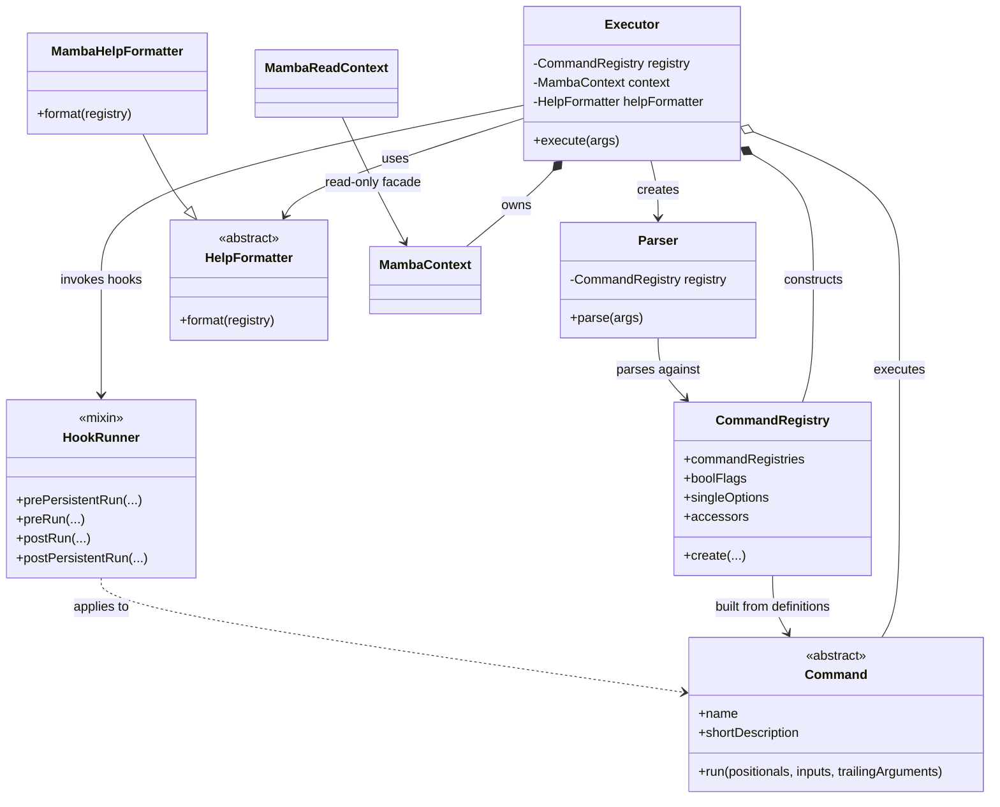
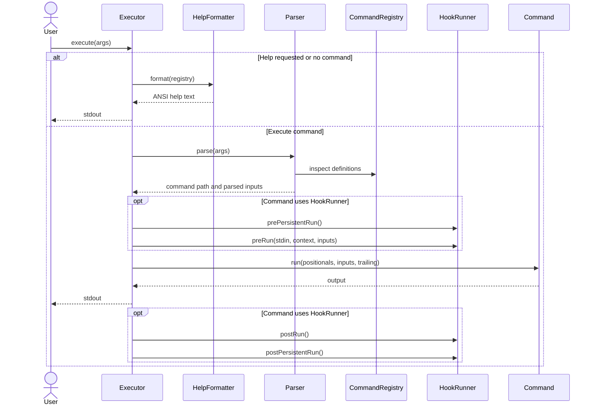
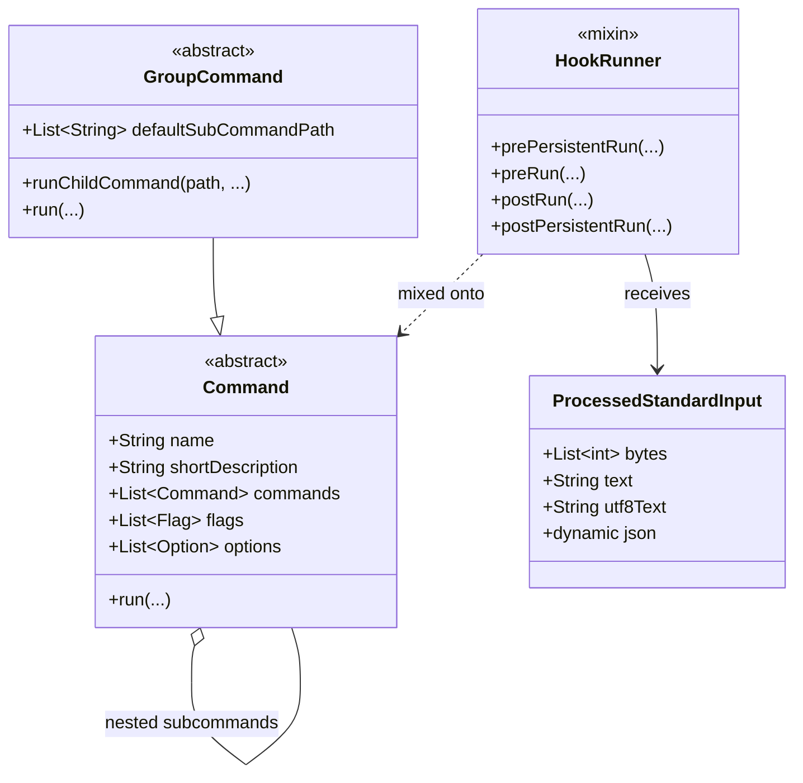
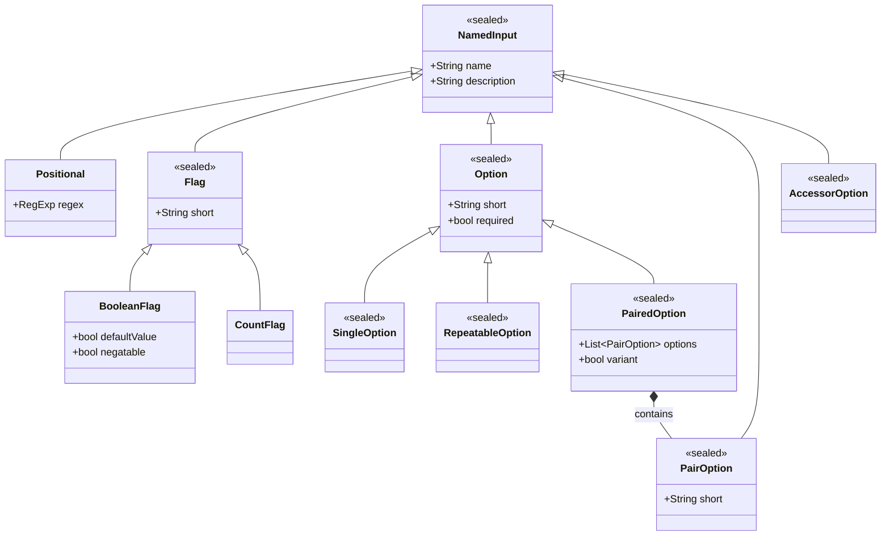
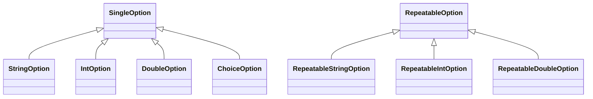
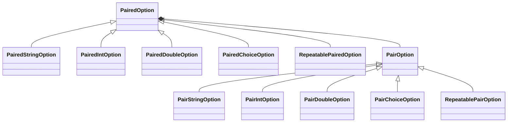
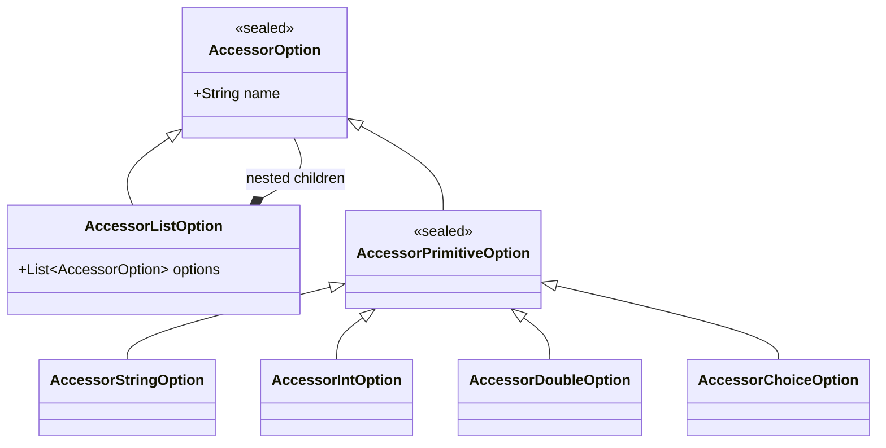
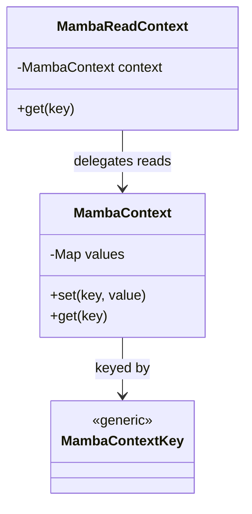
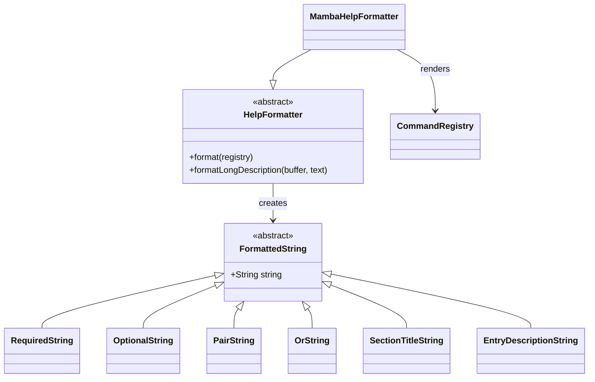
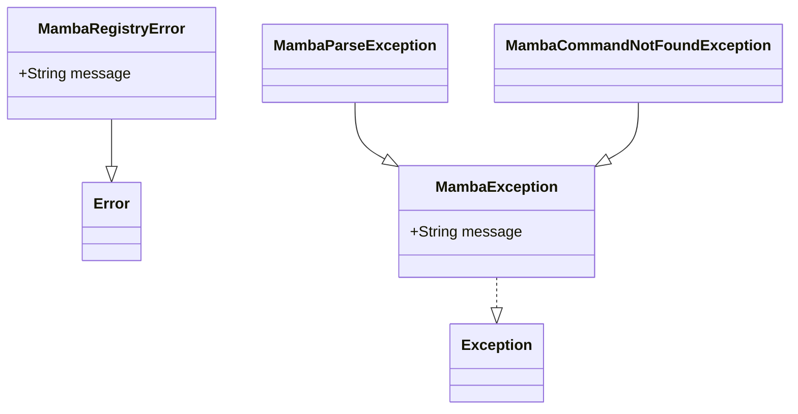

# Project overview

> This overview is based only on the contents of `lib/`.

This is a Dart framework named **Mamba** for defining and executing hierarchical command-line interfaces.

It provides:

- Commands and nested subcommands
- Positional arguments
- Boolean and counting flags
- Typed string, integer, double, and enum options
- Repeatable and paired options
- Nested “accessor” options such as `--database.host`
- Validation and parsing
- Generated ANSI-styled help output
- Shared execution context
- Pre/post execution hooks
- Standard-input processing

`lib/mamba.dart` is the public library barrel that exports the framework.

## High-level architecture



## Execution flow

`Executor` acts as the central coordinator.



Errors are caught by `Executor` and written to `stderr`.

## Command model

Applications extend `Command` to define executable behavior. A command can contain child commands, producing a command tree.

`GroupCommand` adds the ability to select and run a descendant command itself, including a default child path.



`ProcessedStandardInput` exposes piped standard input as:

- Raw bytes
- Character text
- UTF-8 text
- Decoded JSON

## Input type hierarchy

Most CLI definitions inherit from `NamedInput`, which supplies a name and optional description.



### Typed options



A `ChoiceOption` is generic over a Dart `Enum`, but parsed choice values are placed into the string-options result map using the enum member’s name.

### Paired options

Paired options model related values:

- `variant == false`: every member must be supplied together.
- `variant == true`: at most one member may be supplied.
- `required == true`: the group itself must be present.



## Accessor options

Accessors represent nested option paths. For example, a nested definition could be addressed as:

```text
--database.connection.timeout 30
```



The parser returns accessor values as nested maps.

## Registry responsibilities

`CommandRegistry` transforms command definitions into indexed, validated lookup structures.

It:

- Validates command and input names
- Rejects duplicate names
- Reserves `--help` and `-h`
- Separates inputs by concrete type
- Builds registries recursively for child commands
- Optionally propagates flags into descendants

The registry is primarily descriptive—it does not execute commands. `Executor` separately retains the actual `Command` instances so it can call `run()`.

## Context model



Hooks receive:

- Mutable `MambaContext` during persistent hooks
- `MambaReadContext` during command-specific pre/post hooks

This allows shared typed state while restricting mutation in some execution stages.

## Help formatting



The default formatter uses `chalkdart` to render required values, optional values, section headings, descriptions, paired groups, and mutually exclusive variants.

## Error hierarchy



## Current entry point

`lib/main.dart` creates:

```dart
Executor("mamba", "This is the Manba CLI").execute(args);
```

No commands are registered there, so the current executable primarily displays root help. The framework itself is substantially more capable than this minimal entry point demonstrates. There is also a likely typo in the description: **“Manba”** instead of **“Mamba.”**
