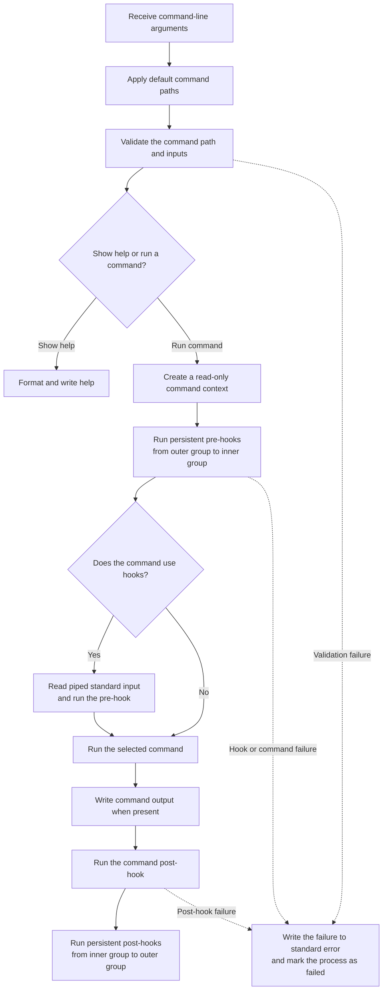
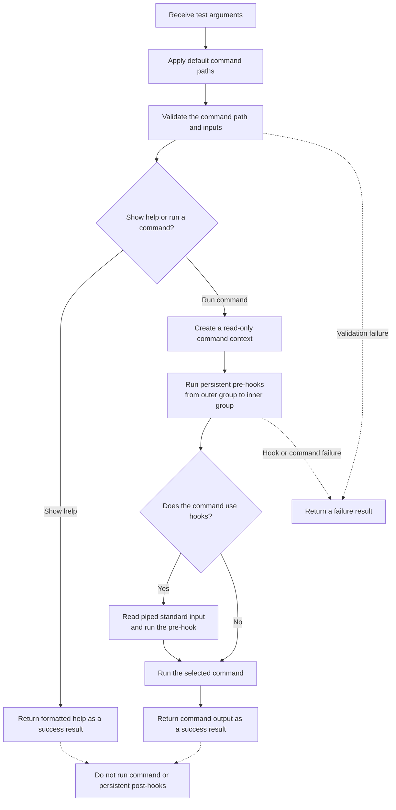

Mamba

## Create executor

The create executor writes command output to standard output. It reports
failures to standard error and marks the process as failed. It also runs
post-hooks after a command finishes.

## Fake executor

The fake executor follows the same selection, validation, and pre-hook flow,
but returns a result for the test to inspect. It never writes to process streams
and does not run post-hooks.

