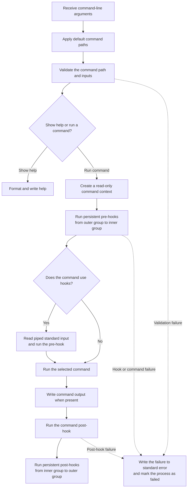
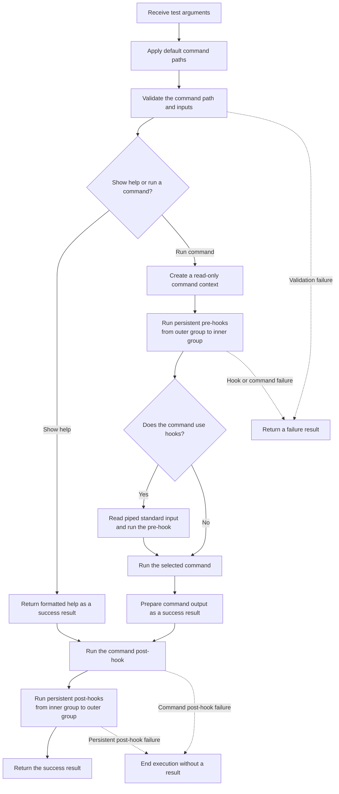

In Mamba the tool that's you use to create your CLI's is called the `Executor`.
It runs [commands](/reference/commands), gives them global [flags](/reference/flags) and [options](/reference/options) and executes [hooks](/reference/hooks).
By default the `help`, `dry-run` and the `verbose` flags are registered. You can't override them! They can only be appended to! 

Command Execution is done through the `execute` method! It's takes the arguments that are passed from main!
Then selects a command and processes non-command arguments based on what was sent! 

Before the execute function could be called you need to call `create` or `fake`. 
The create method is the one that makes what's called the _real executor_. 
This executor is the one that's responsible for executing the command as intended.

The fake one is the one that's meant to give you a result based on success or failure!
By catching and returning Execptions and returning the value from the selected command's `run()`! 

## Create executor


```dart
 Executor("my-cli", "This is a CLI meant ").create().execute();
```

This is the real executor! It's job is to process arguments based on the diagram below!



## Fake executor

This is the executor that's meant to be used for [testing](/references/testing). 

It's repsonsible for sending the selected command's output or catching the exception then sending it!
As a `MambaSuccessResult` when the command succeeds! The `run()`'s output is the `value` field!
As a `MambaFailureResult` when the command fails! An Exception message are placed in the `message` getter. 

```dart
Executor("my-cli", "This is a CLI meant ").fake().execute();
```




## Help 

## Configuration

The executor's options configure what commands can execute and what what flags and options are can be sent to all commands.
By default when help is used without any commands you get the **help output**! 

|Option| Description|
|---|---|
| `longDescription` | A longer description of the the CLI| 
| `flags` | global flags for all commands to consume | 
| `options` | global options for all commands to use |
| `accessors` | global accessors for all commands to use |
| `defaultCommandPath`| The path of the [default command](#default_command) you want to execute|    
| `helpFormatter`| The help formatter that you want to use| 
| `context` | your own writable context| 

### Default command

By default when you run a CLI created by Mamba without a command! You'll get the help menu! 
You can configure the default command by just providing an array that's a series of strings pointing to the command you want to execute.
When provided **the executor will check if the command exist's**! It will **also make sure the path isn't empty**!

:::caution
You can't use any flags or options with this
:::
