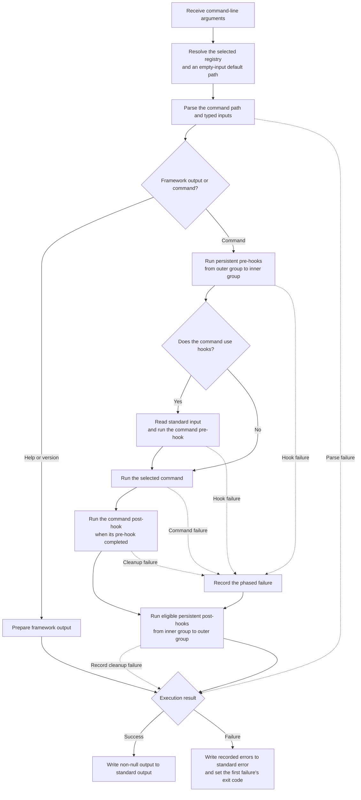
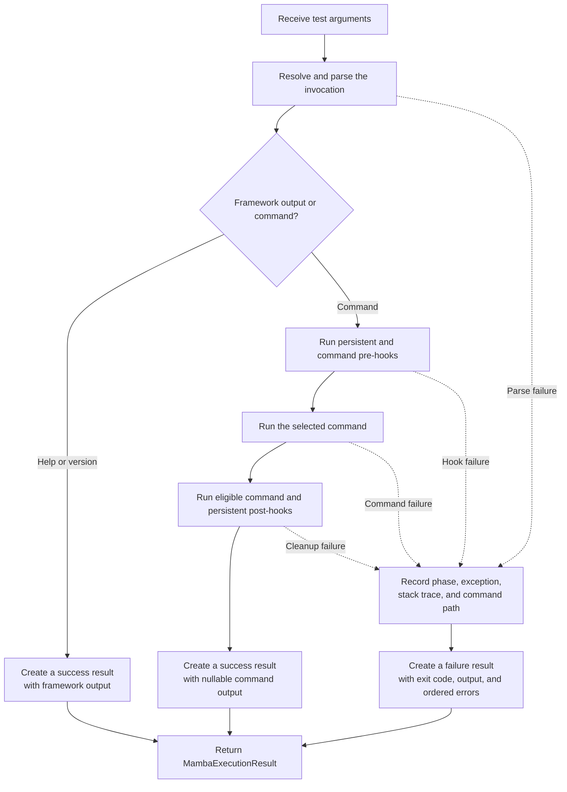

`Executor` is the composition root for a Mamba application. It validates the
command tree, parses each argument list, runs hooks and the selected command,
and delivers the resulting output or failure.

Its four required arguments are the application name, short description,
semantic version, and root command list.

## Production execution

Call `create()` to connect execution to the current process:

```dart
import 'package:mamba/mamba.dart';

Future<void> main(List<String> args) => Executor(
  'my-cli',
  'Manage application resources.',
  '1.0.0',
  [DeployCommand(), StatusCommand()],
).create().execute(args);
```

The production executor forwards non-null command output unchanged to stdout
and writes nothing when the command returns `null`. A successful execution
leaves the process exit code untouched. On failure, the executor writes every
recorded error message to stderr and assigns the first failure's exit code to
the process.

For a custom process boundary, pass a `MambaProcess` implementation to
`create(process: ...)`. This is useful for embedding Mamba without reading or
writing the global Dart process streams. The adapter supplies standard input
and receives output, errors, and failure exit codes.



## Test execution

Call `fake()` to receive a result without process I/O:

```dart
final result = await Executor(
  'my-cli',
  'Manage application resources.',
  '1.0.0',
  [StatusCommand()],
).fake().execute(['status']);

switch (result) {
  case MambaSuccessResult(:final output):
    print(output);
  case MambaFailureResult(:final exitCode, :final errors):
    print('Failed with $exitCode: ${errors.first.exception.message}');
}
```

`MambaSuccessResult.output` is nullable because commands may intentionally
produce no output. `MambaFailureResult` exposes `exitCode`, any output produced
before cleanup failed, and an ordered `errors` list. Each
`MambaExecutionError` records its execution phase, exception, stack trace, and
command path. The `message` getter returns the first exception message.



## Execution lifecycle

For a normal command invocation, Mamba performs these steps:

1. Resolve and parse the command path and inputs.
2. Run persistent pre-hooks from the outermost selected group inward.
3. Read standard input and run the selected command's pre-hook, when present.
4. Run the selected command.
5. Run its post-hook when its pre-hook completed.
6. Run eligible persistent post-hooks in reverse order.
7. Return the success or failure result.

Help and version are control paths. They return framework output without
running command behavior or requiring the command's ordinary inputs.

## Built-in flags

Every executor includes:

- `--help` / `-h`
- `--dry-run`
- `--verbose` / `-v`
- `--version` / `-V`

Mamba parses `--dry-run` and `--verbose`, but application behavior decides
what they mean. Read them with `MambaBuiltInFlags.dryRun` and
`MambaBuiltInFlags.verbose` through `ParsedInputs.valueOf`.

## Configuration

Optional named parameters configure the root command surface:

| Parameter | Purpose |
| --- | --- |
| `longDescription` | Detailed root help text. |
| `flags` | Flags available throughout the command tree. |
| `options` | Options available throughout the command tree. |
| `accessors` | Root dotted accessor trees available to every command. |
| `defaultCommandPath` | Root command path selected when `execute` receives an empty list. |
| `context` | Executor-scoped hook state. |
| `helpFormatter` | Custom help rendering policy. |

The version must satisfy Mamba's Semantic Version 2.0.0-shaped validation,
for example `1.2.3` or `1.2.3-rc.1`.

```dart
final configuration = AccessorListOption('config', [
  AccessorStringOption.required('host'),
]);

final class DeployCommand extends Command {
  
  
  @override
  String get name => 'deploy';

  @override
  String get shortDescription => 'Deploy the application.';

  @override
  String run(ParsedInputs inputs, List<String> args) {
    final values = inputs.valueOf(configuration);
    return 'Deploying to ${values['host']}';
  }
}

final executor = Executor(
  'my-cli',
  'Manage application resources.',
  '1.0.0',
  [DeployCommand()],
  accessors: [configuration],
);
```

The accessor may appear before or after the command token, for example
`my-cli --config.host localhost deploy` or
`my-cli deploy --config.host localhost`.

## Default commands

`defaultCommandPath` is a list of command names relative to the application
root:

```dart
final executor = Executor(
  'my-cli',
  'Manage application resources.',
  '1.0.0',
  [StatusCommand()],
  defaultCommandPath: ['status'],
);
```

The default applies only when the argument list passed to `execute` is empty.
If any flag, option, or command token is present, normal command resolution is
used instead.
