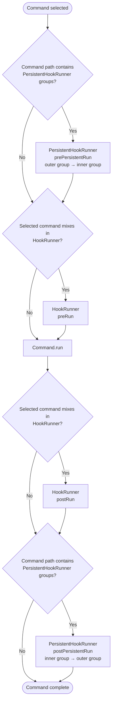

The Mamba [executor](references/executor) runs the selected command based on it's path.
It uses the path that's given to it to iterate through the commmands and it's descendants until it finds the right one.
Throughout this process the commands are being used even though their run functions aren't being called!

Throughout this process commands can call special functions called hooks!
These are the functions that could be called when the `Executor` inspects the [command](references/commands)
When they are called **they are passed the context, positionals, and single options**.

The _context_ is an object that contains dependencies that command might need.
The _positionals_ are the parsed positional arguments! 
The _single options_ are the parsed set of options that aren't repeatable! 

Persistent hooks run in opposite directions so nested groups behave like an
outer wrapper around the command.

## Normal Hooks

Normal hooks are hooks that any command can run! 
The way for a command to use them is by using the `HookRunner` mixin. 
The hook runner mixin forces the command to override the `preRun` method and supplies the `postRun` one. 

## Persistent Hooks 

Persistent hooks are hooks that run regardless of whether the command in the path is selected or not! 
If a command is found in the path these functions will run before the selected commmands hooks run!
These hooks are the ones that allow for the context to be changed!
The way for a comamnd to use them is by using the `PersistentHookRunner` mixin. 
It forces the user to override the `postPersistentRun` method and supplies the `prePersistentRun` one.